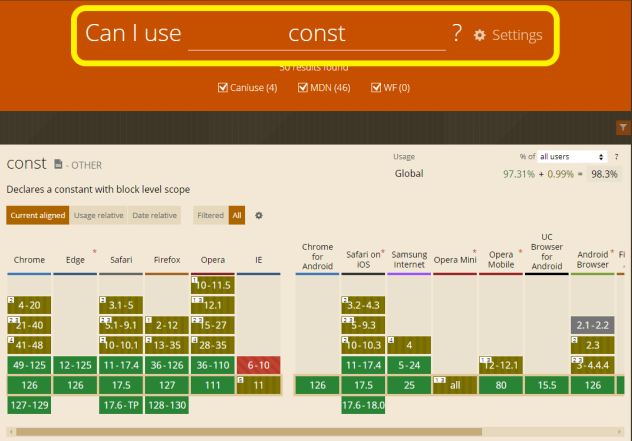
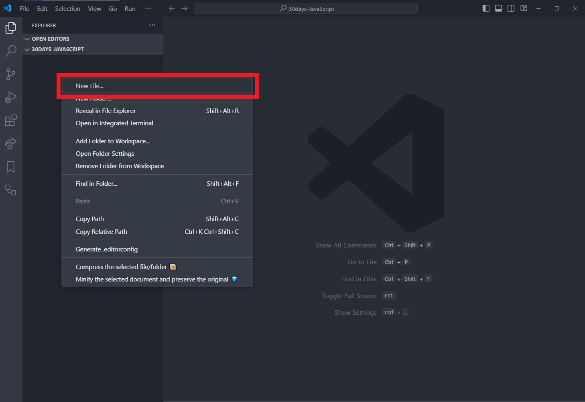
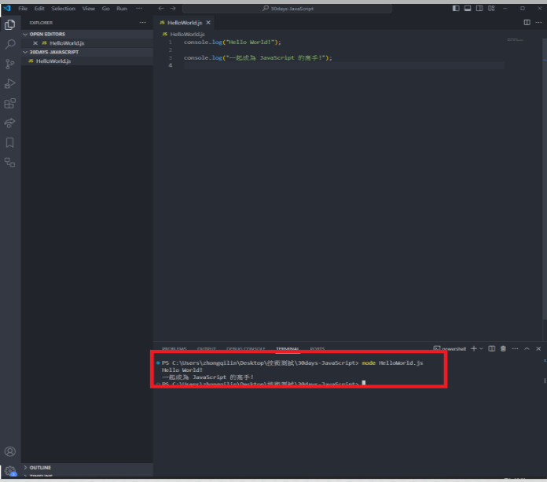

# 【Day1】序章： 簡介 & ES6+ 背景及快速開始

## 介紹

歡迎來到 **JavaScript 新手到高手：現代特性全攻略** 系列文章！這個系列旨在幫助你掌握現代 JavaScript 的各種特性，從基本概念到進階應用，讓你一天接著一天成為
JavaScript 的高手。

在接下來的30天中，我們會每天探討一個新的主題，然而對於常使用到的 **檢查工具** 或是 **安裝方法** 這邊會略微帶過更專注於 JavaScript
的運用，通過實際範例和詳細講解，幫助大家理解並應用這些特性。

為了可以針對某些技術做學習，以下目錄方便大家針對相關技術文章做導頁。

## 目錄

1. [ES6+ 簡介及環境設置](./day1/README.md)
2. [變量聲明：let 和 const](./day2/README.md)
3. [箭頭函數與模板字面量](./day3/README.md)
4. [解構賦值與擴展運算符](./day4/README.md)
5. [函數參數預設值與 Symbol](./day5/README.md)
6. [迴圈：for...of 和迭代器](./day6/README.md)
7. [Array 和 String 的新方法](./day7/README.md)
8. [Number 和 Object 的新方法](./day8/README.md)
9. [Math 的新方法](./day9/README.md)
10. [Promises 基礎與進階](./day10/README.md)
11. [async/await 基礎與進階](./day11/README.md)
12. [事件循環概念與詳解](./day12/README.md)
13. [非阻塞 I/O 概念與應用](./day13/README.md)
14. [類別與繼承](./day14/README.md)
15. [靜態方法與存取器](./day15/README.md)
16. [類別中的私有字段](./day16/README.md)
17. [模組化](./day17/README.md)
18. [Proxy 和 Reflect](./day18/README.md)
19. [Set 和 WeakSet](./day19/README.md)
20. [Map 和 WeakMap](./day20/README.md)
21. [生成器與進階應用](./day21/README.md)
22. [可選鏈式操作符](./day22/README.md)
23. [Nullish 合併運算符](./day23/README.md)
24. [BigInt](./day24/README.md)
25. [全局對象：globalThis](./day25/README.md)
26. [高階函數：map、filter、reduce](./day26/README.md)
27. [簡化的異步處理](./day27/README.md)
28. [模板字面量與標籤模板](./day28/README.md)
29. [擴展運算符的高級用法](./day29/README.md)
30. [現代 JavaScript 項目最佳實踐](./day30/README.md)

# Day 1: ES6+ 簡介及快速開始

## 介紹

在第一天，我們將介紹 ES6+ 的背景和重要性，並幫助你快速設置一個開發環境，讓你能夠運行第一個 JavaScript 程式 "Hello World"。

## ES6+ 的背景與重要性

在開始之前我們可以簡單的了解 JavaScript 發展歷程，ES6 的出現及其對 JavaScript 的重大改進!

JavaScript 誕生就不特別贅述，然而作為一個重要的標準化角色，這邊要對 **ECMAScript** 做特別說明:

- 1995 年，Brendan Eich 在網景公司（Netscape）創建了 JavaScript，以便於在網頁上進行客戶端腳本編寫，增強用戶交互體驗。
- 隨著 JavaScript 的流行，微軟推出了自己的腳本語言 JScript，這導致了瀏覽器之間的不兼容問題。
- 為了解決這一問題，Netscape 將 JavaScript 提交給 ECMA 國際標準化組織，促使其成為一個標準語言。

### ECMAScript 的版本

1997 年時 ECMAScript 1 發布了 第一版 ECMAScript 標準，在這期間更新了許多新的方法，甚至每年還在持續更新新的版本哦!

至於又為何大家比較常提到 ES6 呢? 那是因為ES6，即 ECMAScript 2015，是 JavaScript 的一個重大版本更新，帶來了大量的新特性和語法改進，使得
JavaScript 語言變得更強大和現代化。

然而這些重大更新例如: 新的變量聲明方式、簡化了函數的語法、 多行字符串和嵌入表達式的功能...等，都會在之後幾天的文章說到 。

至於最在意的是如果我接下來學習新的方法，要怎麼確保瀏覽器有支援呢?
這時候推薦大家可以使用 [Can I use](https://caniuse.com/) 看看可不可以使用哦!

在黃框中輸入語法就可以看到目前瀏覽器的支援度等等資訊，甚至 CSS 也可以查詢哦!



## 選擇代碼編輯器及安裝 Node.js 和 npm

### 選擇代碼編輯器

工具百百種，這裡建議大家可以先以最廣泛支持度最高的先做練習，這裡以常見的 Visual Studio Code (VS Code) 做示範。

- **下載和安裝**：
    - 前往 [VS Code 官方網站](https://code.visualstudio.com/)，下載適合的操作系統版本。
    - 運行下載的安裝程序，按照提示完成安裝。

### 安裝 Node.js 和 npm

Node.js 是以 V8 為核心，讓電腦可以以 Command line 的方式去執行 JavaScript，所以這邊一起來安裝吧!

- **下載和安裝**：
    - 前往 [Node.js 官方網站](https://nodejs.org/)，下載最新的 LTS（長期支持）版本。
    - 運行下載的安裝程序，按照提示完成安裝。

- **確認安裝**：
    - 安裝 Node.js 的同時會自動安裝 npm
    - 打開終端（命令提示符）並輸入以下命令，確認 Node.js 和 npm 是否安裝成功：
      ```bash
      node -v
      npm -v
      ```

### 為什麼需要安裝 Node.js 和 npm

JavaScript 本身是一種可以在瀏覽器中運行的腳本語言，因此在瀏覽器中運行 JavaScript 代碼是不需要安裝 Node.js 和 npm
的。然而，當涉及到現代 JavaScript 開發，尤其是涉及到開發工具、模組管理和構建過程時，安裝 Node.js 和 npm
是非常常見且推薦的做法!

1. **開發工具**：
    - 現代 JavaScript 開發通常需要使用構建工具和打包工具（如 Webpack、Babel），這些工具大多基於 Node.js。
    - npm 是 Node.js 的包管理工具，用於安裝和管理這些工具。

2. **模組管理**：
    - npm 提供了豐富的 JavaScript 庫和模組，可以方便地在項目中使用。
    - 通過 npm，你可以輕鬆地管理項目的依賴關係，並確保版本一致性。

3. **本地開發服務器**：
    - Node.js 可以用於啟動本地開發服務器，方便測試和開發。
    - 常見的開發服務器工具如 Express、lite-server 等。

### 一起快速看到成果!

1. **打開 VSCode**
   在新的資料夾內新增一個新的 HelloWorld.js 的檔案



2. **輸入程式碼**
    - 在 `HelloWorld.js` 檔案中輸入如下指令：
      ```javascript
      console.log("Hello World!");
 
      console.log("一起成為 JavaScript 的高手!");
      ```
    - 按下 `Ctrl + ~` 打開 VSCode 終端機。
    - 在終端機中輸入以下命令來運行 `HelloWorld.js` 檔案：
      ```bash
      node HelloWorld.js
      ```

   

### 故障排除步驟

如果你沒有看到預期的輸出，請檢查以下幾個方面：

1. **文件名稱和路徑**：
    - 確保你在終端機中運行的文件名稱和實際文件名稱一致。
    - 確保你在終端機中所處的路徑是包含 `HelloWorld.js` 文件的目錄。

2. **Node.js 安裝**：
    - 確保 Node.js 已經正確安裝，並且可以在終端機中正常運行。可以輸入以下命令來檢查 Node.js 版本：
      ```bash
      node -v
      ```
    - 如果沒有輸出版本號，請重新安裝 Node.js。

3. **代碼錯誤**：
    - 檢查你的 `HelloWorld.js` 文件中的代碼是否有拼寫錯誤或語法錯誤。確保代碼與提供的範例一致。

## 本篇自我挑戰
何謂自我挑戰，~~問題不怕困難，重點是要解決出問題的人(誤~~，嘗試開始! 在這裡你可以看到大家是怎麼回答題目的，甚至會看到暗藏的高手可以將簡單的題目回答的淋漓盡致!

- 今日挑戰：有沒有辦法自己 console.log 出一個屬於自己的文字？
- 反思：有沒有辦法在 console.log 裡面做數學運算呢？

## 總結

在第一天的學習中，我們了解了 ES6+ 的背景和重要性，並設置了一個快速的開發環境，運行了第一個 JavaScript 程式 "Hello World"
。歡迎在討論區互動交流，明天我們一起迎接新的**變數**關卡吧!

## 聯繫我

如果有任何問題或建議，歡迎隨時聯繫我：

- [GitHub](https://github.com/Chung-Chi-Lin)
- [Email](mailto:z0925955648@gmail.com)

## 版權聲明

本系列文章版權歸屬於作者，禁止未經許可的轉載和商業用途。歡迎個人學習和分享。
